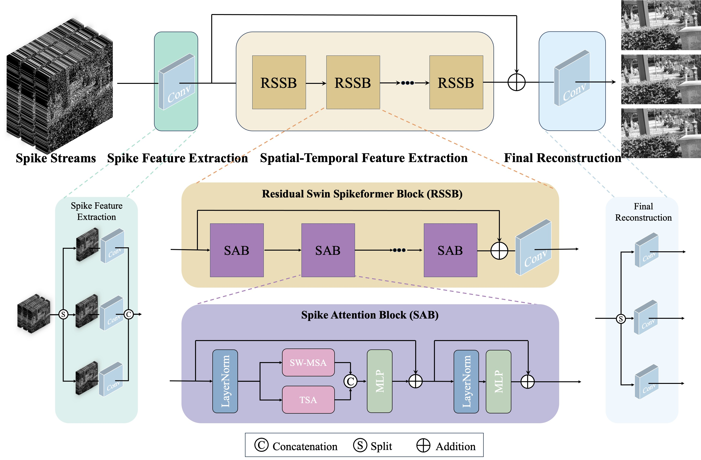
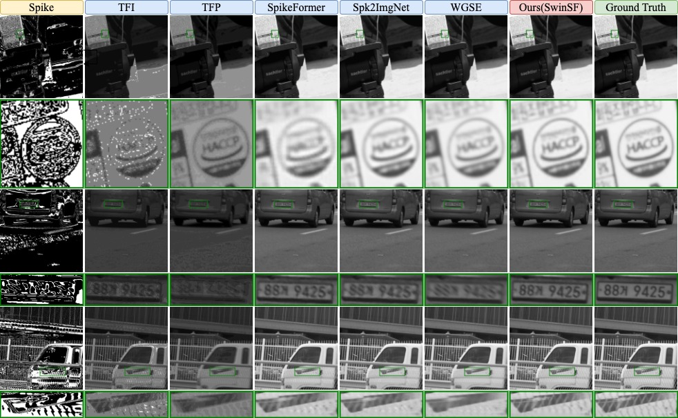
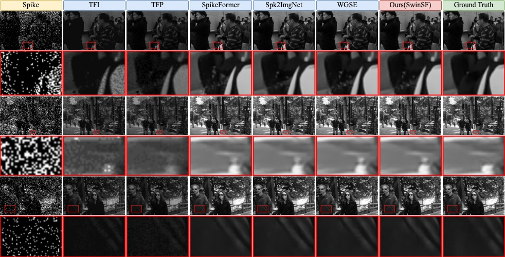
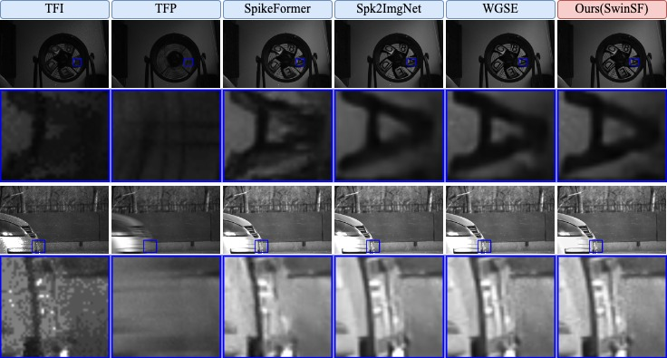

<h3 align="center">📄 [English README](./README.md) | 🇨🇳 [中文说明文档](./README_CN.md)
</h3>
<h2 align="center"> 
  <a href="https://ieeexplore.ieee.org/abstract/document/11028676/">SwinSpikeFormer: Learning Comprehensive Spatial-Temporal Representation to Reconstruct Dynamic Scenes from Spike Streams</a>
</h2>
<h5 align="center"> 
If you like our project, please give us a star ⭐ on GitHub.  </h5>

<h5 align="center">
📢📢📢 <b>News</b>: Our paper has been <b>accepted by ICVRV 2024</b> and will be officially published in <b>December 2024</b>! 🎉<br>
Please check the final IEEE version here: <a href="https://ieeexplore.ieee.org/abstract/document/11028676/">10.1109/ICVRV62410.2024.00020</a>
</h5>

<h5 align="center">

**Authors:** Liangyan Jiang, [Chuang Zhu](https://teacher.bupt.edu.cn/zhuchuang/zh_CN/index.htm)✉️ and Yanxu Chen from BUPT, Beijing, China.


[](https://arxiv.org/abs/2407.15708)
[](https://github.com/bupt-ai-cz/SwinSF)
[](https://github.com/bupt-ai-cz/SwinSF)
[](https://twitter.com/intent/tweet?text=Codes%20and%20Data%20for%20Our%20Paper:%20"SwinSF:%20Image%20Reconstruction%20From%20Spatial-Temporal%20Spike%20Streams"%20&url=https://github.com/bupt-ai-cz/SwinSF)  &#160;

</h5>

Welcome to the **SwinSF** project! This repository contains the implementation of the **Swin Spikeformer (SwinSF)** model, as described in the paper ["SwinSpikeFormer: Learning Comprehensive Spatial-Temporal Representation to Reconstruct Dynamic Scenes from Spike Streams"](https://ieeexplore.ieee.org/abstract/document/11028676/). SwinSF is designed to reconstruct high-quality images from spike streams generated by spike cameras, which are particularly useful for high-speed imaging where motion blur is a challenge.

<p align="center">  
  
</p>

## 📕 Abstract
>  The spike camera, with its high temporal resolution, low latency, and high dynamic range, addresses high-speed imaging challenges like motion blur. It captures photons at each pixel independently, creating binary spike streams rich in temporal information but challenging for image reconstruction. Current algorithms, both traditional and deep learning-based, still need to be improved in the utilization of the rich temporal detail and the restoration of the details of the reconstructed image. To overcome this, we introduce Swin Spikeformer (SwinSF), a novel model for dynamic scene reconstruction from spike streams. SwinSF is composed of Spike Feature Extraction, Spatial-Temporal Feature Extraction, and Final Reconstruction Module. It combines shifted window self-attention and proposed temporal spike attention, ensuring a comprehensive feature extraction that encapsulates both spatial and temporal dynamics, leading to a more robust and accurate reconstruction of spike streams. Furthermore, we build a new synthesized dataset for spike image reconstruction which matches the resolution of the latest spike camera, ensuring its relevance and applicability to the latest developments in spike camera imaging. Experimental results demonstrate that the proposed network SwinSF sets a new benchmark, achieving state-of-the-art performance across a series of datasets, including both real-world and synthesized data across various resolutions.

## 👀 Visual Comparisons
<details open><summary><strong>Spike-X4K Dataset </strong></summary>
<p align="center">

</p>
</details>

<details open><summary><strong>Spike-Reds dataset </strong> </summary>
<p align="center">

</p>
</details>

<details open><summary><strong>ClassA dataset </strong> </summary>
<p align="center">

</p>
</details>

## 💪 Getting Started

### 🌏 Prerequisites

Before you begin, ensure you have met the following requirements:
- Python 3.6.13
- PyTorch 1.10.0+cu113
- Other dependencies as listed in `requirements.txt`

You can install the required packages using pip:

```bash
pip install -r requirements.txt
```
### 📖 Datasets

### Datasets

- **spike-X4K**: This is a new simulated dataset created specifically for this project by our teams. It contains spike streams paired with ground truth images at a resolution of 1000x1000 pixels. The spike-X4K dataset is designed to enhance the performance and evaluation of spike-based image reconstruction algorithms. You can download this dataset from [Baidu Wangpan](https://pan.baidu.com/s/1N6tMru-fn5iJ0oyygHg1hQ?pwd=cps6). The page of the new dataset is [Papers with Code](https://paperswithcode.com/dataset/spike-x4k).

- **spike-reds**: This is a simulated dataset with ground truth images at a resolution of 250x400 pixels. It is sourced from the paper [Spk2ImgNet: Learning to Reconstruct Dynamic Scene from Continuous Spike Stream](https://openaccess.thecvf.com/content/CVPR2021/papers/Zhao_Spk2ImgNet_Learning_To_Reconstruct_Dynamic_Scene_From_Continuous_Spike_Stream_CVPR_2021_paper.pdf). This dataset is not created by our team, so please contact the original authors to download it.

- **spike-classA**: This dataset was captured using a spike camera by the Peking University team. It consists of images at a resolution of 250x400 pixels and does not include ground truth images. This dataset is also not created by our team, so please contact the original authors to download it.

To begin with the SwinSF project, you will need to download the datasets and put them into ./datasets directory.

Please note that the reds and classA datasets are not created by our team, so please contact the original authors to download them.


## 💻 Training

To train the SwinSF model on the reds dataset, use the following command:
```bash
python train.py --data_mode 250 --dataset_path ./datasets/spike_reds --device cuda:0
```
For the X4K dataset, use:
```bash
python train.py --data_mode 1000 --dataset_path ./datasets/spike_x4k --device cuda:0
```
To train using multiple GPUs, add the --device_ids 01 option (make sure the first device in device_ids matches the --device setting). For CPU training, simply use --device cpu.

Training weights will be automatically saved to the checkpoint directory.

## 📊 Testing

To test the model and save the reconstructed images for the reds dataset, use:
```bash
python test.py --data_mode 250 --dataset_path ./datasets/spike_reds --device cuda:0 --load_model /path/to/training/parameters --save_image True --save_path /path/to/save/images
```
For the X4K dataset:
```bash
python test.py --data_mode 1000 --dataset_path ./datasets/spike_x4k --device cuda:0 --load_model /path/to/training/parameters --save_image True --save_path /path/to/save/images
```
And for the classA dataset:
```bash
python test.py --data_mode 250 --dataset_path ./datasets/classA --device cuda:0 --load_model /path/to/training/parameters --save_image True --save_path /path/to/save/images
```

## 🌅 Model Weights
We provide pre-trained weights for two resolutions, which can be downloaded from [Baidu Wangpan](https://pan.baidu.com/s/1Rkwz0bbie5kumZykkJMtyg?pwd=x7z8), code is : x7z8.

## 📧 Contact
If you have any questions, please feel free to contact [lander@bupt.edu.cn](mailto:lander@bupt.edu.cn) or [czhu@bupt.edu.cn](mailto:czhu@bupt.edu.cn).


## 🤝 Citation
If you find our work useful for your research, please consider citing our paper:
```
@INPROCEEDINGS {11028676,
author = { Jiang, Liangyan and Zhu, Chuang and Chen, Yanxu },
booktitle = { 2024 International Conference on Virtual Reality and Visualization (ICVRV) },
title = {{ SwinSpikeFormer: Learning Comprehensive Spatial-Temporal Representation to Reconstruct Dynamic Scenes from Spike Streams }},
year = {2024},
volume = {},
ISSN = {},
pages = {60-65},
abstract = { The spike camera, with its high temporal resolution, low latency, and high dynamic range, addresses high-speed imaging challenges such as motion blur. It captures photons at each pixel independently, creating binary spike streams rich in temporal information. However, these binary spike streams present a challenge for their reconstruction into images, which is necessary for performing subsequent downstream tasks. Current algorithms, both traditional and deep learning-based, fail in utilizing this rich temporal information and restoring the details of the reconstructed image. To tackle this challenge, we propose Swin Spikeformer (SwinSF), a novel model for dynamic scene reconstruction from spike streams. SwinSF is composed of three main modules: Spike Feature Extraction, Spatial-Temporal Feature Extraction, and Final Reconstruction Module. The Spike Feature Extraction Module uses convolution layers to directly extract features from the spike streams. The Spatial-Temporal Feature Extraction Module includes several Residual Swin Spikeformer Blocks (RSSB), which integrate shifted window self-attention and proposed Temporal Spike Attention (TSA) to effectively extract both spatial and temporal information from intra-frames and inter-frames, leading to a more robust and accurate reconstruction of spike streams. The Final Reconstruction Module fuses both spike and spatial-temporal features to produce the final image reconstruction. Furthermore, we have built a new synthesized dataset for spike image reconstruction, featuring high resolution and enhanced temporal fidelity through the use of frame interpolation techniques, which ensures its relevance and applicability to realistic spike camera imaging scenarios. Experimental results demonstrate that our proposed network, SwinSF, sets a new benchmark, achieving state-of-the-art performance across a series of datasets, including both real-world and synthesized data across various resolutions. Our codes and proposed dataset can be found at https://github.com/bupt-ai-cz/SwinSF. },
keywords = {Solid modeling;Dynamics;Virtual reality;Feature extraction;Cameras;Transformers;Real-time systems;Spatial resolution;Image reconstruction;Streams},
doi = {10.1109/ICVRV62410.2024.00020},
url = {https://doi.ieeecomputersociety.org/10.1109/ICVRV62410.2024.00020},
publisher = {IEEE Computer Society},
address = {Los Alamitos, CA, USA},
month =Dec}

```
