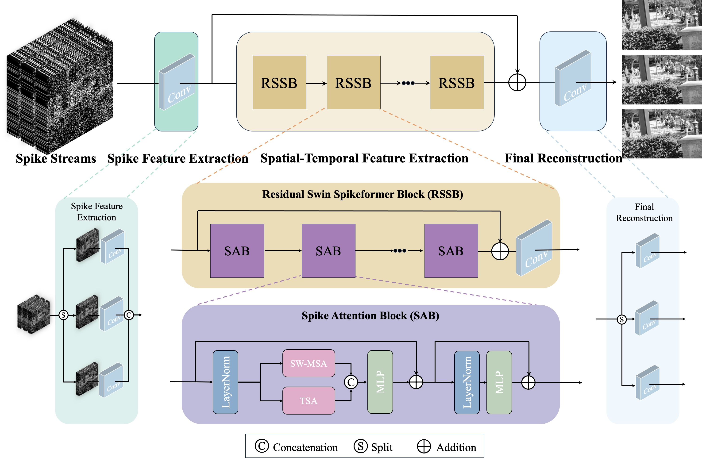
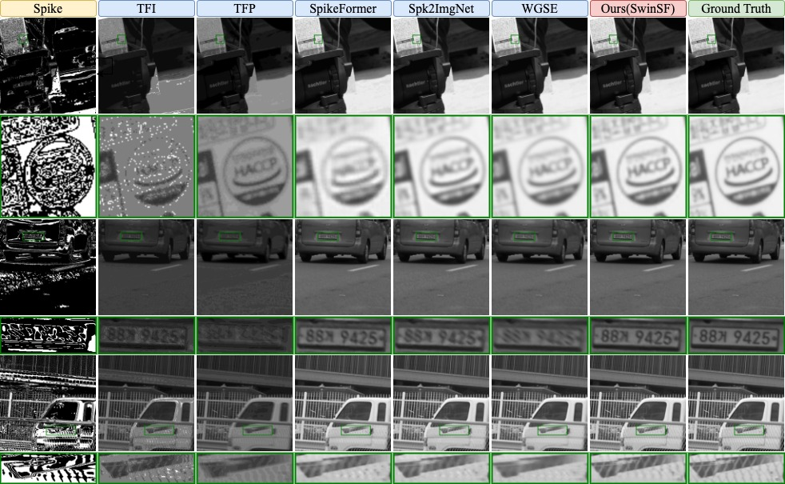
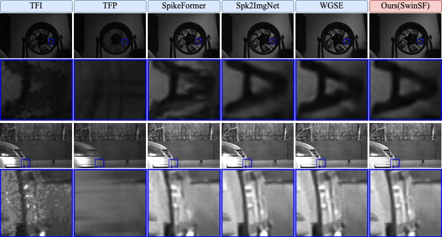

<h3 align="center">
📄 <a href="./README.md">English README</a> | 🇨🇳 <a href="./README_CN.md">中文说明文档</a>
</h3>

<h2 align="center"> 
  <a href="https://ieeexplore.ieee.org/abstract/document/11028676/">SwinSpikeFormer: 基于时空脉冲流的动态图像重建方法</a>
</h2>
<h5 align="center"> 
如果您喜欢本项目，请点击右上角为我们点一个 star ⭐！</h5>

<h5 align="center">
📢 <b>最新动态</b>：我们的论文已被 <b>ICVRV 2024</b> 正式接收，并将于 <b>2024 年 12 月</b> 正式发表 🎉<br>
请在 IEEE 上查看正式版本：<a href="https://ieeexplore.ieee.org/abstract/document/11028676/">10.1109/ICVRV62410.2024.00020</a>
</h5>

<h5 align="center">
<b>作者：</b> 江良言、<a href="https://teacher.bupt.edu.cn/zhuchuang/zh_CN/index.htm">祝闯</a>✉️、陈彦旭（北京邮电大学）
</h5>

<p align="center">
  [](https://ieeexplore.ieee.org/document/11028676)
  [](https://arxiv.org/abs/2407.15708)
  [](https://github.com/bupt-ai-cz/SwinSF)
  [](https://github.com/bupt-ai-cz/SwinSF)
</p>

欢迎访问 **SwinSF 项目主页**！本项目提供了论文 [SwinSpikeFormer: Learning Comprehensive Spatial-Temporal Representation to Reconstruct Dynamic Scenes from Spike Streams](https://ieeexplore.ieee.org/abstract/document/11028676/) 中提出的 **Swin Spikeformer (SwinSF)** 模型的官方实现。该模型专为处理脉冲相机生成的脉冲流数据并重建高质量图像而设计，特别适用于高速运动成像、消除运动模糊等任务场景。

<p align="center">  
  
</p>

## 📕 摘要简介
> 脉冲相机具有极高的时间分辨率、低延迟和高动态范围，能够很好地应对运动模糊等高速成像问题。其工作方式是独立地在每个像素上采集光子，生成具有丰富时间信息的二值脉冲流。然而，这类脉冲流在图像重建中面临巨大挑战。现有方法在时间信息的利用和图像细节的恢复方面仍存在明显不足。为此，我们提出 SwinSpikeFormer（SwinSF），这是一种面向动态场景脉冲图像重建的创新方法。SwinSF 包括脉冲特征提取、时空特征提取和最终重建三个模块，结合了滑窗自注意力机制与我们提出的时间脉冲注意力机制，有效融合空间和时间特征，实现鲁棒且高保真的图像重建。此外，我们还构建了一个新型高分辨率模拟脉冲图像数据集 Spike-X4K，适配最新硬件。大量实验结果验证了 SwinSF 在多个真实与模拟数据集上均达到最先进性能。

## 👀 可视化对比

<details open><summary><strong>Spike-X4K 数据集</strong></summary>
<p align="center">

</p>
</details>

<details open><summary><strong>Spike-Reds 数据集</strong></summary>
<p align="center">

</p>
</details>

<details open><summary><strong>ClassA 数据集</strong></summary>
<p align="center">

</p>
</details>

## 💪 快速开始

### 🌏 环境依赖

请确保您的环境满足以下条件：
- Python 3.6.13
- PyTorch >= 1.10.0 + cu113
- 其他依赖项请查看 `requirements.txt`

安装命令如下：

```bash
pip install -r requirements.txt
```

### 📖 数据集说明

- **spike-X4K**：我们团队新构建的 1000×1000 分辨率高保真脉冲图像重建数据集，可用于评估模型在高分辨率条件下的性能。[百度网盘下载](https://pan.baidu.com/s/1N6tMru-fn5iJ0oyygHg1hQ?pwd=cps6)，也已发布于 [Papers with Code](https://paperswithcode.com/dataset/spike-x4k)。

- **spike-reds**：分辨率为 250×400 的模拟数据集，来源于 CVPR 2021 的 Spk2ImgNet 论文（非我们构建）。

- **spike-classA**：由北大采集，分辨率 250×400，无 GT（非我们构建）。

下载后请将数据放入 `./datasets` 文件夹中。

## 💻 训练

在 REDS 数据集上训练：

```bash
python train.py --data_mode 250 --dataset_path ./datasets/spike_reds --device cuda:0
```

在 X4K 数据集上训练：

```bash
python train.py --data_mode 1000 --dataset_path ./datasets/spike_x4k --device cuda:0
```

多卡训练请增加参数 `--device_ids 01`（首个 GPU 与 `--device` 参数保持一致）。

## 📊 测试

```bash
# REDS 数据集测试
python test.py --data_mode 250 --dataset_path ./datasets/spike_reds --device cuda:0 --load_model /path/to/params --save_image True --save_path /path/to/output

# X4K 数据集测试
python test.py --data_mode 1000 --dataset_path ./datasets/spike_x4k --device cuda:0 --load_model /path/to/params --save_image True --save_path /path/to/output

# ClassA 数据集测试
python test.py --data_mode 250 --dataset_path ./datasets/classA --device cuda:0 --load_model /path/to/params --save_image True --save_path /path/to/output
```

## 🌅 预训练权重

已提供两个分辨率的训练权重文件：[百度网盘下载链接](https://pan.baidu.com/s/1Rkwz0bbie5kumZykkJMtyg?pwd=x7z8)，提取码：x7z8。

## 📧 联系我们

如有任何问题，欢迎联系：  
📬 [lander@bupt.edu.cn](mailto:lander@bupt.edu.cn) 或 [czhu@bupt.edu.cn](mailto:czhu@bupt.edu.cn)

## 🤝 引用方式

```
@INPROCEEDINGS{11028676,
author = { Jiang, Liangyan and Zhu, Chuang and Chen, Yanxu },
booktitle = { 2024 International Conference on Virtual Reality and Visualization (ICVRV) },
title = {{ SwinSpikeFormer: Learning Comprehensive Spatial-Temporal Representation to Reconstruct Dynamic Scenes from Spike Streams }},
year = {2024},
pages = {60-65},
doi = {10.1109/ICVRV62410.2024.00020},
url = {https://doi.ieeecomputersociety.org/10.1109/ICVRV62410.2024.00020}
}
```